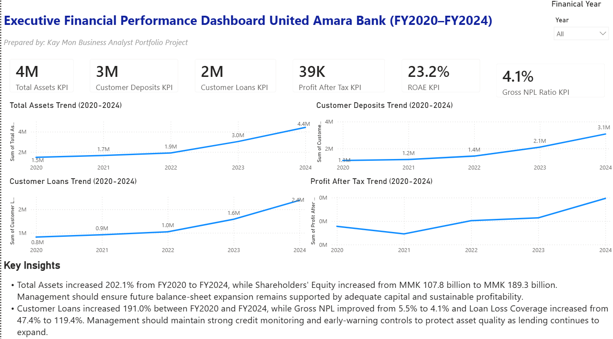
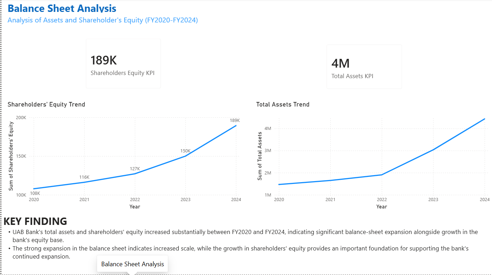
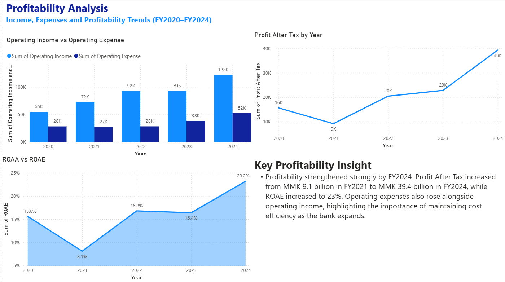
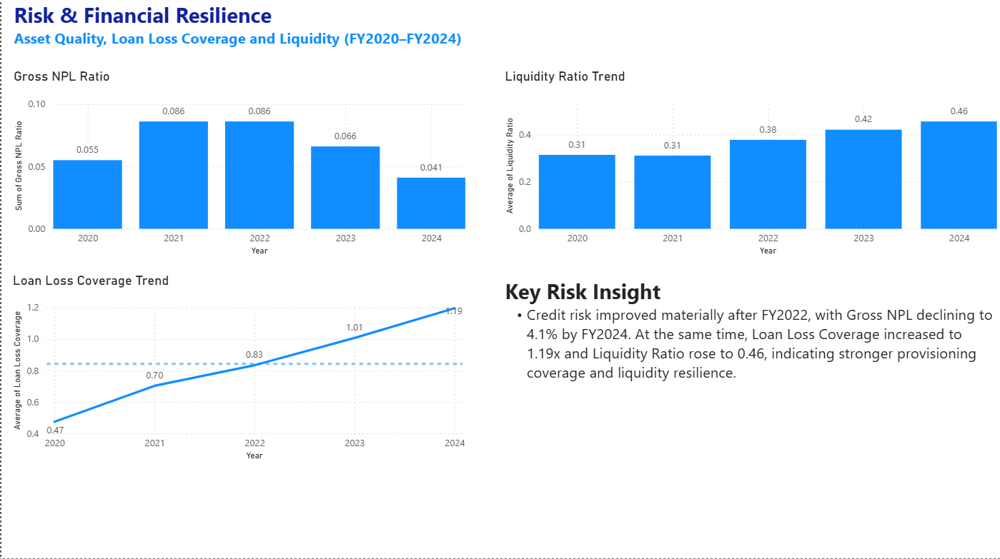
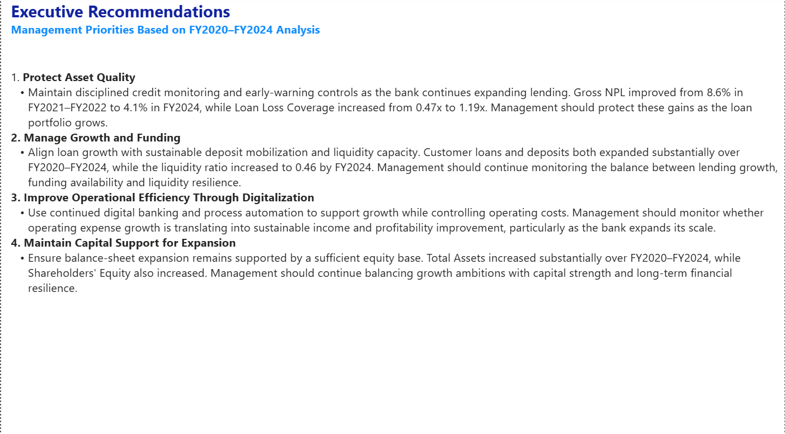

# UAB Bank Executive Financial Performance Dashboard

## Project Overview

A Business Analyst and Power BI consulting project analysing United Amara Bank (UAB)'s financial performance across FY2020–FY2024.

The project transforms publicly available financial information into an interactive executive dashboard designed to support management-level analysis and decision-making.

## Business Problem

UAB's financial information is primarily presented through static annual reports. This makes it time-consuming to compare performance across years, identify trends and evaluate financial risks.

The project addresses this by consolidating key financial indicators into an interactive Power BI dashboard.

## Business Objective

The objective is to provide management with a clear view of:

- Financial growth
- Lending and customer funding
- Profitability
- Asset quality
- Liquidity
- Financial resilience

## Business Questions

The analysis addresses ten key questions covering:

1. Balance-sheet growth
2. Customer deposit growth
3. Customer loan growth
4. Operating income and expense trends
5. Profitability
6. Credit risk
7. Loan-loss coverage
8. Liquidity
9. Financial strengths and risks
10. Strategic management actions

## Data

### Reporting Period

FY2020–FY2024

### Source

UAB Bank published annual reports and financial statements.

### Key Metrics

- Total Assets
- Shareholders' Equity
- Customer Deposits
- Customer Loans
- Operating Income
- Operating Expenses
- Profit After Tax
- ROAA
- ROAE
- Gross NPL Ratio
- Loan Loss Coverage Ratio
- Liquidity Ratio

## Dashboard Preview

### Executive Overview

### Balance Sheet Analysis

### Profitability Analysis

### Risk & Financial Resilience

### Executive Recommendations

## Key Findings

- Total Assets increased by 202.1% between FY2020 and FY2024.
- Customer Loans increased by 191.0%.
- Customer Deposits increased by 175.5%.
- Profit After Tax increased by 152.5%.
- Gross NPL Ratio improved from 5.5% to 4.1%.
- Loan Loss Coverage increased from 0.47x to 1.19x.
- Loan growth outpaced deposit growth, creating a key funding-management consideration.

## Business Recommendations

1. Protect asset quality as lending continues to expand.
2. Monitor sustainable funding and funding diversification.
3. Improve operational efficiency through digitalisation and process automation.
4. Maintain adequate capital support for continued balance-sheet expansion.

## Tools

- Microsoft Excel
- Power BI
- DAX
- Power Query
- Visual Studio Code
- Markdown

## Skills Demonstrated

- Business Analysis
- Financial Analysis
- Banking KPI Analysis
- Data Preparation
- Data Modelling
- Power BI Dashboard Development
- DAX
- Power Query
- Trend Analysis
- Business Insight Generation
- Executive Reporting
- Strategic Recommendations

## Limitations

The analysis is based on publicly disclosed financial information. Not all financial statement line items are consistently disclosed across the full FY2020–FY2024 period. Missing values were not estimated or fabricated.

## Disclaimer

This is an independent analytical portfolio project based on publicly available UAB Bank financial information. It is not an official UAB Bank report or management document.